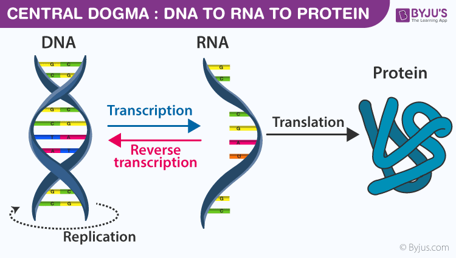
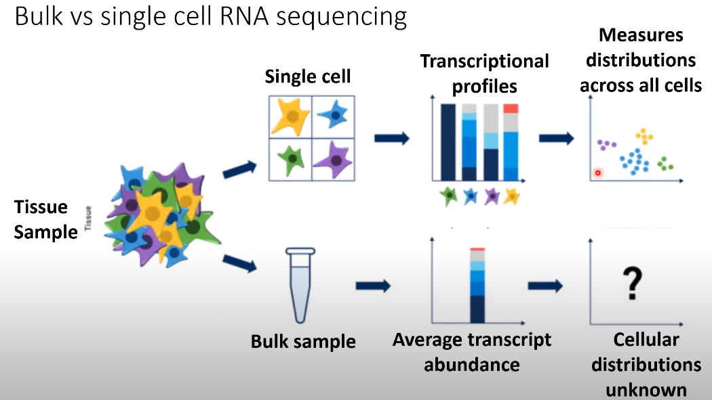

# Single-Cell
Notes and studies about single-cell analysis
## Vocabulary
* **Central dogma of molecular biology**

  

* A **tisuue** is a group of cells that have similar structure and function together as a unit. 
* **Transcription profiling:** Also known as **expression profiling**. It involves the quantification of gene expression of many genes in cells or tissue samples at the transcription (RNA) level.
* **Gene expression** is the process by which information from a gene is used in the synthesis of functional gene product that enables it to produce end products, protein or non-coding RNA, end ultimately phenotype, as final effect.
* **Tissue heterogeneity** refers to the fact that data generated with biological samples can be compromised by cells originating from other tissues or organs than the target tissue or organ of profiling. It can be caused by biological processes (such as immune cell infiltration), sample contamination, or mistakes in sample labelling.
*  **Read counts** are the total number of mRNAs from a gene that you sequenced.
*  **UMI (Unique Molecular Identifier) counts** are the total number of unique mRNAs for a gene that you captured.

## Notes
* Single-cell RNA-seq can asses the global state of all mRNA transcripts being expresses within a tissue with single-cell resolution, so with high content measures.
* Single-cell RNA-seq enables questions about tissue heterogeneity and how cells transition between different phsiological states.

* **Bulk vs Single-cell RNA sequencing**

 

  

* **Goals of scRNA-seq**
   - Measure the distribution of expression levels for each gene across a population of cells.
   - Measure transcriptional differences across and within groups of cells.
   - Resolve single-cell heterogeneity.
   
* **Overview of Single-cell RNA sequencing**

 

  

* Unique molecular identifiers (UMIs) reduce amplification error

 

  

## References
  1. UCLA QCBio Collaboratory - [Webinars on Youtube](https://www.youtube.com/watch?v=jwSPTgF9ESQ&t=1177s)
