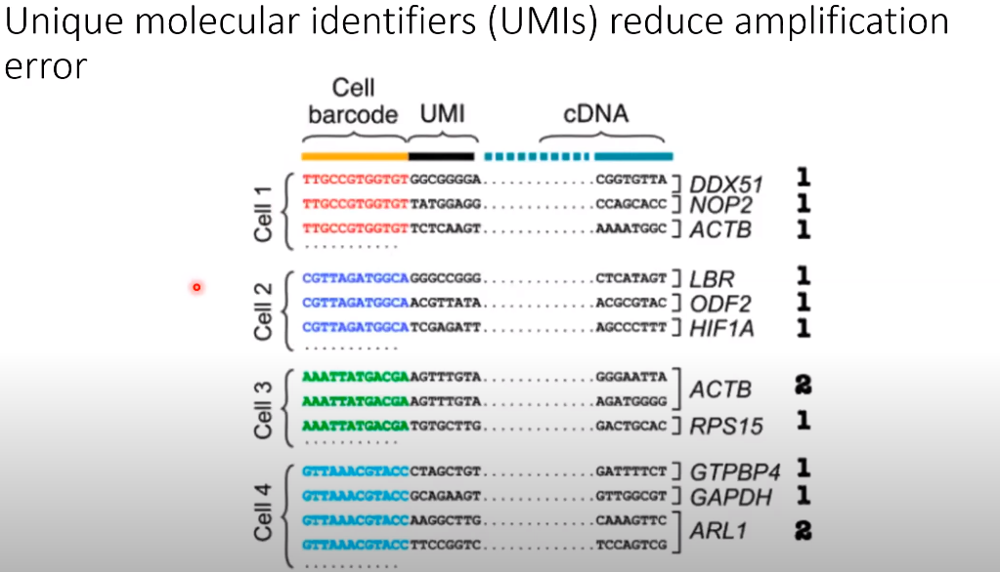
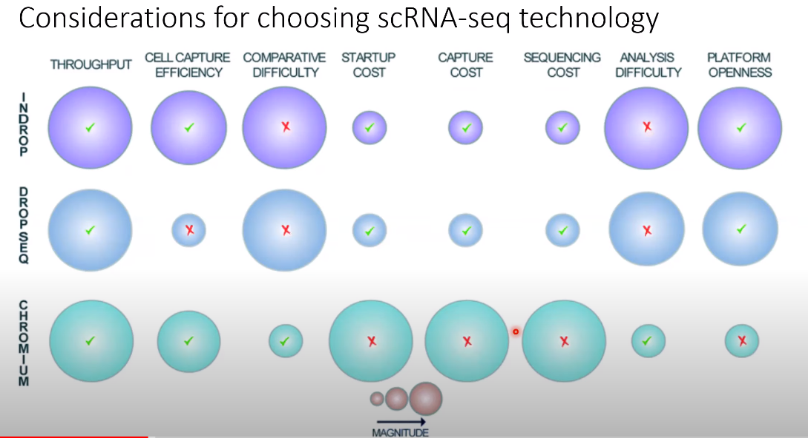
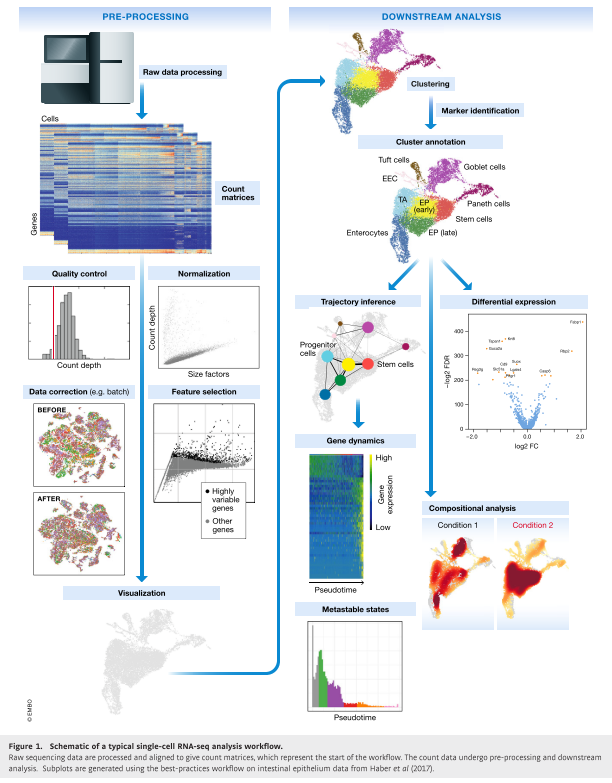

# Single-Cell Data Analysis
Notes and studies about single-cell analysis
## Vocabulary
* **Central dogma of molecular biology**

  

* A **tisuue** is a group of cells that have similar structure and function together as a unit. 
* **Transcription profiling:** Also known as **expression profiling**. It involves the quantification of gene expression of many genes in cells or tissue samples at the transcription (RNA) level.
* **Gene expression** is the process by which information from a gene is used in the synthesis of functional gene product that enables it to produce end products, protein or non-coding RNA, end ultimately phenotype, as final effect.
* **Tissue heterogeneity** refers to the fact that data generated with biological samples can be compromised by cells originating from other tissues or organs than the target tissue or organ of profiling. It can be caused by biological processes (such as immune cell infiltration), sample contamination, or mistakes in sample labelling.
*  **Read counts** are the total number of mRNAs from a gene that you sequenced.
*  **UMI (Unique Molecular Identifier) counts** are the total number of unique mRNAs for a gene that you captured.
*  **Demultiplexing** refers to the step in processing where you'd use the barcode information in order to know which sequences came from which samples after they had all be sequenced together.
*  In molecular biology, a **transcription factor (TF)** (or sequence-specific DNA-binding factor) is a protein that controls the rate of transcription of genetic information from DNA to messenger RNA, by binding to a specific DNA sequence.
*  A **doublet** is the case of two cells being lysed and sequenced within the same droplet.

## Notes
* Single-cell RNA-seq can asses the global state of all mRNA transcripts being expresses within a tissue with single-cell resolution, so with high content measures.
* Single-cell RNA-seq enables questions about tissue heterogeneity and how cells transition between different phsiological states.

* **Bulk vs Single-cell RNA sequencing**

 

  

* **Goals of scRNA-seq**
   - Measure the distribution of expression levels for each gene across a population of cells.
   - Measure transcriptional differences across and within groups of cells.
   - Resolve single-cell heterogeneity.
   
* **Overview of Single-cell RNA sequencing**

 

  

* Unique molecular identifiers (UMIs) reduce amplification error

 

  

* UMI counts compromise the gene by cell matrices for the analysis.

* Consideration for choosing scRNA-seq technology

 

  

* **Single cell RNA-seq analysis workflow**

 

  

After demultiplexing the data, we end up with a gene count by cell matrix where each column represents a single cell, and the rows of that column are the sum of UMIs detected for each gene species.

## Technical Variation
* Single-cell RNA-sequencing is a noisy technique that only captures about 5% of mRNA from each cell.
* Each cell's transcriptional profile is intrinsically variable from one cell to the next because of biology. So, how can we distinguish "what is technical variation?" and "what is biological variation?".
* Attempts to minimize the impact of technical variation occur at the data analysis steps.

#### Standard pipeline for minimizing the impact of technical variation:

**Step-1:** Use UMI counts, not reads. This avoids variation introduced by amplification and reverse transcription.

**Step-2:** Use quality control metrics to remove low quality cells.

**Step-3:** Normalize the data, which generally assumes the same number of total mRNAs per cell. (ie. Counts per million or CPM).

**Step-4:** Log Transform is applied in attempt to stabilize the variance that arises from the differences in the mean expression of each gene.

**Step-5:** Feature selection, which usually involves identifying a set of "Highly Variable Genes-HGVs".

**Step-6:** PCA, which capture only some of the variation in the data. Once we identify biologically informative genes which we assume are the HVGs, researchers typically apply principal component analysis to further reduce the dimensionality of the data and only capture major axes variation.

### Data Analysis Pipeline
A. **Quality control:** The first step in the data analysis pipeline is to filter the data using quality control metrics such as count depth, with the idea being to remove low-quality or dead cells from the gene by cell matrix.

 :heavy_exclamation_mark: GOAL: Identify and minimize technical variation that arises from low quality cells. 

There are three main parameters that inform us about the quality of the cell:
1. **Count depth** is the number of total UMIs that were detected in the cell.
2. **Number of genes** is the number of different genes identified per cell.
3. **Fraction of mitochondrial counts** is the fraction of mitochondrial genes relative to all genes within the cell.

It is the best practice to consider multiple parameters jointly in order to remove poorly amplified or damaged/dead cells and doublets.

**Quality control pitfalls and recommendations**

1. Consider filtering outliers identified by:
   * number of genes
   * count depth
   * fraction of mitochondrial reads
   * fraction of bio to spike in reads 
2. Be permisssive:
   * You risk losing real data and entire population of varying cell types.
3. Consider each sample independently:
   * If QC covariate distributions vary between samples, determine QC parameters seperately for each sample.

B. **Normalization and Batch Correction:**

 :heavy_exclamation_mark: GOAL: Nor malize the variation due to differences in count depth in order to prepare for the model of highly variable gene  (HGV) selection 

The idea of the preprocessing pipeline is to remove variation that arises due to the measurement error alone.

**CPM normalization technique:** Main assumption is that all cells have equal mRNA molecules, thus, count depth due to the differences in sampling.
* However, in droplet-based approaches the assumption that cell size can effect the read depth such that if you have a bigger cell, the capture process might become saturated.

* $$ CPM_i = {{r_i \over R}* 10^6 $$
 
C. **Log Transformation:**
The idea is to stabilize the variance for genes whose averages are order of magnitudes different.
## References
  1. UCLA QCBio Collaboratory - [Webinars on Youtube](https://www.youtube.com/watch?v=jwSPTgF9ESQ&t=1177s)
  2. https://en.wikipedia.org/wiki/Transcription_factor
  3. Luecken, M. D., & Theis, F. J. (2019). Current best practices in single‐cell RNA‐seq analysis: a tutorial. Molecular systems biology, 15(6), e8746.
