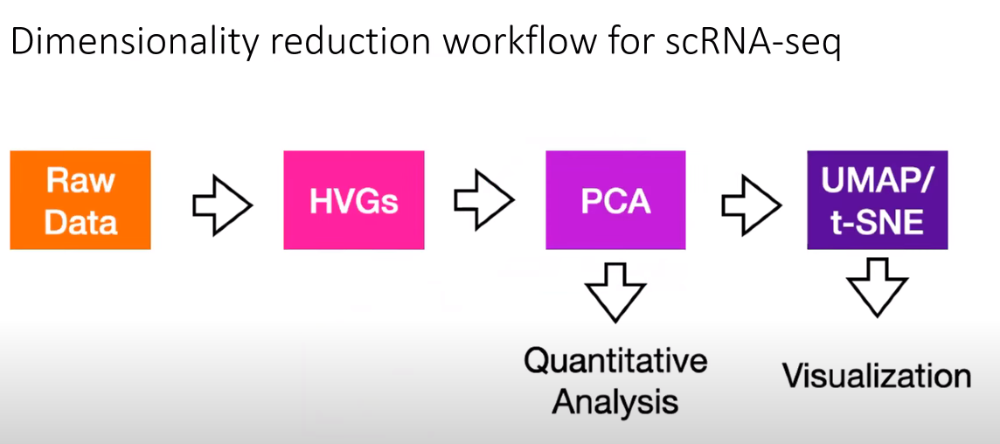

# Single-Cell Data Analysis
Notes and studies about single-cell analysis
## Vocabulary
* **Central dogma of molecular biology**

  

* A **tisuue** is a group of cells that have similar structure and function together as a unit. 
* **Transcription profiling:** Also known as **expression profiling**. It involves the quantification of gene expression of many genes in cells or tissue samples at the transcription (RNA) level.
* **Gene expression** is the process by which information from a gene is used in the synthesis of functional gene product that enables it to produce end products, protein or non-coding RNA, end ultimately phenotype, as final effect.
* **Tissue heterogeneity** refers to the fact that data generated with biological samples can be compromised by cells originating from other tissues or organs than the target tissue or organ of profiling. It can be caused by biological processes (such as immune cell infiltration), sample contamination, or mistakes in sample labelling.
* **Read counts** are the total number of mRNAs from a gene that you sequenced.
* **UMI (Unique Molecular Identifier) counts** are the total number of unique mRNAs for a gene that you captured.
* **Demultiplexing** refers to the step in processing where you'd use the barcode information in order to know which sequences came from which samples after they had all be sequenced together.
* In molecular biology, a **transcription factor (TF)** (or sequence-specific DNA-binding factor) is a protein that controls the rate of transcription of genetic information from DNA to messenger RNA, by binding to a specific DNA sequence.
* A **doublet** is the case of two cells being lysed and sequenced within the same droplet.
* **Cell cycle effect:** During the cell cycle a cell increases in size, replicates its DNA and splits into daughter cells. Different cells are at different time points of this cycle and thus they may have quite different expression profiles, even if they are cells of the same type.
* **ERCC RNA Spike-In Control Mixes** provide a set of external RNA controls that enable performance assessment of a variety of technology platforms used for gene expression experiments. 

# Notes
## DAY - 1
* Single-cell RNA-seq can asses the global state of all mRNA transcripts being expresses within a tissue with single-cell resolution, so with high content measures.
* Single-cell RNA-seq enables questions about tissue heterogeneity and how cells transition between different phsiological states.

* **Bulk vs Single-cell RNA sequencing**

 

  

* **Goals of scRNA-seq**
   - Measure the distribution of expression levels for each gene across a population of cells.
   - Measure transcriptional differences across and within groups of cells.
   - Resolve single-cell heterogeneity.
   
* **Overview of Single-cell RNA sequencing**

 

  

* Unique molecular identifiers (UMIs) reduce amplification error

 

  

* UMI counts compromise the gene by cell matrices for the analysis.

* Consideration for choosing scRNA-seq technology

 

  

* **Single cell RNA-seq analysis workflow**

 

  

After demultiplexing the data, we end up with a gene count by cell matrix where each column represents a single cell, and the rows of that column are the sum of UMIs detected for each gene species.

## Technical Variation
* Single-cell RNA-sequencing is a noisy technique that only captures about 5% of mRNA from each cell.
* Each cell's transcriptional profile is intrinsically variable from one cell to the next because of biology. So, how can we distinguish "what is technical variation?" and "what is biological variation?".
* Attempts to minimize the impact of technical variation occur at the data analysis steps.

#### Standard pipeline for minimizing the impact of technical variation:

**Step-1:** Use UMI counts, not reads. This avoids variation introduced by amplification and reverse transcription.

**Step-2:** Use quality control metrics to remove low quality cells.

**Step-3:** Normalize the data, which generally assumes the same number of total mRNAs per cell. (ie. Counts per million or CPM).

**Step-4:** Log Transform is applied in attempt to stabilize the variance that arises from the differences in the mean expression of each gene.

**Step-5:** Feature selection, which usually involves identifying a set of "Highly Variable Genes-HGVs".

**Step-6:** PCA, which capture only some of the variation in the data. Once we identify biologically informative genes which we assume are the HVGs, researchers typically apply principal component analysis to further reduce the dimensionality of the data and only capture major axes variation.

### Data Analysis Pipeline
A. **Quality control:** The first step in the data analysis pipeline is to filter the data using quality control metrics such as count depth, with the idea being to remove low-quality or dead cells from the gene by cell matrix.

 :heavy_exclamation_mark: GOAL: Identify and minimize technical variation that arises from low quality cells. 

There are three main parameters that inform us about the quality of the cell:
1. **Count depth** is the number of total UMIs that were detected in the cell.
2. **Number of genes** is the number of different genes identified per cell.
3. **Fraction of mitochondrial counts** is the fraction of mitochondrial genes relative to all genes within the cell.

It is the best practice to consider multiple parameters jointly in order to remove poorly amplified or damaged/dead cells and doublets.

**Quality control pitfalls and recommendations**

1. Consider filtering outliers identified by:
   * number of genes
   * count depth
   * fraction of mitochondrial reads
   * fraction of bio to spike in reads 
2. Be permisssive:
   * You risk losing real data and entire population of varying cell types.
3. Consider each sample independently:
   * If QC covariate distributions vary between samples, determine QC parameters seperately for each sample.

B. **Normalization and Batch Correction:**

 :heavy_exclamation_mark: GOAL: Normalize the variation due to differences in count depth in order to prepare for the model of highly variable gene  (HGV) selection 

The idea of the preprocessing pipeline is to remove variation that arises due to the measurement error alone.

**CPM normalization technique:** Main assumption is that all cells have equal mRNA molecules, thus, count depth due to the differences in sampling.
* However, in droplet-based approaches the assumption that cell size can effect the read depth such that if you have a bigger cell, the capture process might become saturated.

$$ CPM_i = {{r_i \over R} 10^6} $$
 
C. **Log Transformation:**
The idea is to stabilize the variance for genes whose averages are order of magnitudes different.

**Further Corrections of Data:**

 :heavy_exclamation_mark: GOAL: minimize affect of variation due to the batch, dropout or cell cycle effects 

1. Biological covariates: 

* Remove cell-cycle effects on transcriptome - cell-cycle score.
* Regress out mito-gene expression.

2. Technical covariates: 

* Count depth
* Batch effects
* Expression recovery-imputation

**IMPORTANT: Try to avoid introducing bias, when you do preprocessing data analysis.**

## DAY -2 
#### Steps to prepare scRNAseq data for clustering
* Propocessing: Align and count UMIs
* Batch effects removal
* Quality control
* Normalization and imputation
* **Feature selection: Selecting highly veriable genes (HVGs).**
* **Dimensionality reduction (using PCA)**
* Visualizing heterogeneity using t-SNE or UMAP.

General challenge in studies with big data including scRNAseq data is how we can comprehend data that has tens of thousands of dimensions.

**Clustering algorithms** are applied to partition cells with similar gene expression patterns into groups. Groups are compared against each other for patterns of change.
However, clustering itself an extremely high dimensional data is problematic. This is known as the **curse of dimensionality** means that when you have data that is dissimilar in many ways, distances between similar groups
become smaller such that it is no longer obvious how to partition data into different groups.

Is there a way to identify which subset of genes contribute the most to the distribution of cells?

How do we know what is the most informative subset of genes for cell clustering and downstream analysis?
 

  

* The first step is to try to distinguish technical variation from biological variation. Then remove the technical variation.
* **Highly variable genes** are those genes that are selected because they vary more than what would be expected based on null model of technical noise,
so after highly variable genes are identified principal component analysis (PCA) is often applied.
* **PCA** is a dimensionality reduction technique that finds the directions of maximal variance in the data and linearly transforms
the data such that the reduced space is a linear combination of the original space.
  * Each component in PCA is determined by some combination of genes.
  * Often cells are then clustered for transcriptional similarity using PCA coordinates as the basis.
* Finally, UMAP and t-SNE projections can be applied to visualize the differences.
* The goal of dimensionality reduction in scRNAseq data is to prepare the data for cell type clustering.
* Cell type clustering if performed on cell by cell distance matrix where the distances between cells represent L2 or euclidean distances
in an n-dimensional space.
* The dimensions would be the principal component vectors that each represent a linear combination of highly variable genes.
* If you have two cells, and they express the exact same set of genes at the same levels, they occupy the same position in gene expression space such that the distance between them is zero.
* It is critical how you create cell by cell distance matrix.

 :heavy_exclamation_mark: GOAL: 
The goal of feature selection and dimensionality reduction is to generate cell by cell matrix upon which cell type clustering can be performed.

#### Feature selection and dimensionality reduction:

* The goal of feature selection is to select the subset of genes which are the most informative
of  biological differences across cells.
* How can we build a model of technical variation? The standard approaches seek to identify highly variable genes.
* This approach calculates **coefficient of variation** for each gene which is a measure of how spread out the gene count is over all cells
relative to the mean count for that particular genes over all cells.
* **In highly variable gene selection procedure;**
  * We first calculate the coefficient of variation for each gene across the population of cells.
  * Then, we fit a generalized linear model to the model of coefficient of variation relative to the mean.
  * This function attempts to model the variation that would be expected to arise from capture process alone as a 
    function of the starting concentration of the mRNA.
  * This model of technical noise can be parametrized using either distribution of all genes or of synthetic ercc spike-ins. 
   Because, the ercc spike-ins have a fixed starting concentration and are uniformly distributed throughout all droplets.
  * The variation in ercc couch should only arise from technical noise in the capture process and not due to any biological variation.
  * Current standard approaches advise selecting 2k to 5k highly variable genes for downstream analysis. 

#### Principal Component Analysis:

* The goal of PCA is to find which linear combination of genes accounts for the most variance in the distribution of the cell gene data.
* Why do we need to do PCA?
  * The idea is selecting the directions of maximal variation that the clustering algorithms will work better.
  * PCA is used to reduce the dimensionality of the data so that each cell is plotted in axes that represent directions of maximal variance.
  * These directions of variance are determined by principal components which represent a metagene which is a linear combination of information across correlated sets of genes.
  * PCA is often performed on CMP normalized HVGs.
  * We find the elbow dimension of principal components and project our cells into a reduced space where each axis is a principal component that explains
  a high fraction of variance in the sata.
  * So, the next step is calculating cell by cell distances using this dimensionality reduced basis.

## Useful Links:
 1. [Scripts for "Current best-practices in single-cell RNA-seq: a tutorial"](https://github.com/theislab/single-cell-tutorial): Single cell current best practices tutorial case study for the paper:Luecken and Theis, "Current best practices in single-cell RNA-seq analysis: a tutorial"
 2. [scRNA-workshop](https://github.com/czheluo/scRNAseq-workshop): Single cell RNA-seq data analysis with R AND Python workshop 2020 in MAJORBIO
 3. [Awesome Single cell](https://github.com/seandavi/awesome-single-cell): About Community-curated list of software packages and data resources for single-cell, including RNA-seq, ATAC-seq, etc.
 4. [scRNAseq-analysis-notes](https://github.com/crazyhottommy/scRNAseq-analysis-notes): scRNAseq analysis notes
 5. [scRNA-seq data analysis tools and papers](https://github.com/mdozmorov/scRNA-seq_notes): A list of scRNA-seq analysis tools
 6. [UCLA QCBio Collaboratory Single-Cell RNA-Seq Analysis with Python - Day 1](https://www.youtube.com/watch?v=jwSPTgF9ESQ&list=PLOXLw2he7kYpqAL0Gzco5NkA2DpewtluK&index=2), [Day-2](https://www.youtube.com/watch?v=HTOoMH7UMYw&list=PLOXLw2he7kYpqAL0Gzco5NkA2DpewtluK&index=3), [Day 3](https://www.youtube.com/watch?v=9vszIR8pZHc&list=PLOXLw2he7kYpqAL0Gzco5NkA2DpewtluK&index=4)
 9. [A workshop website: Machine Learning for Single Cell Analysis](https://www.krishnaswamylab.org/workshop)
 10. [mLLMCelltype](https://github.com/cafferychen777/mLLMCelltype): An iterative multi-LLM consensus framework for cell type annotation in single-cell RNA sequencing data
## References
  1. UCLA QCBio Collaboratory - [Webinars on Youtube](https://www.youtube.com/channel/UC_Nsj_F_u7X7Il9x9V-g-sQ)
  2. https://en.wikipedia.org/wiki/Transcription_factor
  3. Luecken, M. D., & Theis, F. J. (2019). Current best practices in single‐cell RNA‐seq analysis: a tutorial. Molecular systems biology, 15(6), e8746.
